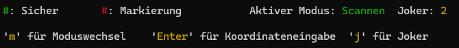
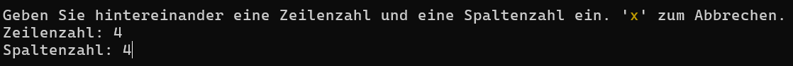

# Dokumentation

# Inhaltsverzeichnis
1. [Einleitung](#introduction)

    1.1 [Spiel ausführen]()

    1.2 [Vorüberlegung und erste Ideen]()

2. [Programmablauf](#1)

    2.1 [Projektaufbau]()

    2.2 [Die verschiedenen Dateien]()

3. [Das Userinterface: Interaktion mit dem Spiel](#2)

    3.1 [Darstellung der Raumstation]()

    3.2 [Die Legende]()
    
    3.3 [Koordinateneingabe und Joker]()
4. [Wichtige Codebestandteile](#1)

    4.1 [Was ist ein Raum? - spaceshipRoom.py]()

    4.2 [Was ist eine Karte? - spaceshipMap.py]()

    4.3 [Spielstart - Räume generieren]()


5. [Bibliotheken](#1)

6. [Testergebnisse und Analyse](#0)


# Einleitung <a name="introduction"></a>

Im Rahmen der Python-Vorlesung an der DHBW im Kurs TIS24 haben die Studenten die Aufgabe bekommen, ein Spiel in Python zu entwickeln. Die folgende Dokumentation dokumentiert meinen Code und meine Ideen, die ich in den letzten Wochen umgesetzt habe.

## Vorüberlegungen und erste Ideeen

Das Ziel des Spiels soll es sein, alle Räume einer Raumstation zu scannen und dabei den Scan eines Raums, der als "gefährlich"  markiert ist, zu vermeiden. Dabei sollen bereits gescannte Räume anzeigen, wie viele der nebenliegenden Räume "gefährlich"  sind.

Die Spielprinzipien sind folgende:

* Es gibt ein Spielfeld mit Bereichen, wobei jeder Bereich _sicher_ oder _gefährlich_ sein kann
* In einem Spielzug kann ein Bereich gescannt werden. Wenn der Bereich _sicher_ ist, erscheint in diesem Bereich eine Zahl die angibt, wie viele umliegende Bereiche _gefährlich_ sind
* Wenn alle _sicheren_ Bereiche gescannt wurden und man keinen _gefährlichen_ Bereiche gescannt hat, hat man das Spiel gewonnen

### Die Raumstation als verbundene Räume

<div style="float: left; margin-right: 15px; max-width: 300px;">
  
</div>


*Abbildung 1: Demonstration von Problemen*

Um die Spielregeln zu erfüllen und den Spielspaß zu garantieren, ist es nötig, sich vorher ein paar Grundideeen zu überlegen. Grundsätzlich wäre es möglich, ein Raster als Spielfeld zu verwenden, allerdings ist eine Raumstation eher eine Ansammlung von Räumen, die miteinander verbunden sind. Somit soll das Programm Räume generieren, welche miteinander verbunden sind. Es gibt aber Probleme, wenn Räume nur über einen Weg verbunden sind. 

Wenn der Spieler in _Abbildung 1_ die Information über Raum 0 hat, dass dieser gefährlich ist aber keine Information über Raum 2 hat, so ist der Scan von Raum 2 rein zufällig und kann, wenn man Pech hat, das Spiel beenden. Solche Situation führen zur Verringerung des Spielspaßes und müssen deshalb vermieden werden, wenn es möglich ist. Trotzdem ist es unvermeidlich, dass Bereiche entstehen könnten, bei welchen ein Raum nur "auf gut Glück" gescannt werden muss. Deshalb hat man im Spielverlauf Joker die dem Spieler verraten, was sich in einem Raum befindet, ohne diesen Scannen zu müssen.


### Räume generieren

Eine der wichtigsten Funktionen ist somit das Generieren von Räumen der Raumstation. Räume werden also in einem Algorithmus generiert, der eine bestimmte Anzahl von Räumen und Verbindungen generiert und dann abbricht. Es müssen zufällig bereits bestehende Räume ausgewählt werden, die nicht bereits an jeder Seite einen Nachbarraum haben. Dann wird dieser zufällig ausgewählte Raum in eine zufällige Richtung erweitert, wenn der neue Raum Nachbar-Räume hat, wird der neue Raum mit diesen Nachbarn verbunden.

### Userinterface
Wohl eines der wichtigsten Dinge für optimale User-Experience ist das Userinterface. Es sollte einfach erkennbar sein, welche Räume man gescannt hat und welche man scannen kann. Ein Userinterface sollte stets einfach zu nutzen sein, aber trotzdem alle wichtigen Informationen auf einen Blick anzeigen. Wichtig für das Spiel ist:
* Eine Karte der Räume
* Gescannte Räume zeigen Anzahl der gefährlichen Nachbarräume an
* Scannen eines neuen Raumes

Eine Karte, die einen Raum darstellt könnte ungefähr so aussehen, wobei jede Raute (#) einen nicht gescannten Raum zeigt und gescannte Räume die Anzahl an nebenliegenden gefährlichen Räumen anzeigen. Die Verbindungen zwischen den Zeichen stellen die Verbindungen der Räume da.

```
  1 - #       # - #
    \ |     / | \
      2 - 1 - # - #
      |       | X |
      #       # - 1
```
*Abbildung 2 Vorüberlegung für die Darstellung von Räumen*

Es muss irgendwie für den User möglich sein, dem Spiel mitzuteilen, welcher Raum als nächstes gescannt werden soll. Es wäre hier nicht praktikabel jedem Raum einfach eine Nummer zu geben den User nach der Nummer des Raumes zu fragen, den er aufdecken möchte, weil es hier Probleme mit einer kompakten Darstellung gäbe. Wie will man denn wie in Abbildung 2 gezeigt, jetzt noch wohlmöhlich 2-stellige Zahlen an die Räume notieren, ohne dass das Userinterface unschön wird?

Eine einfachere Methode für den User, mit unter schwerer im Code, ist die Möglichkeit für den User mithilfe der Pfeiltasten oder den Tasten WASD den Raum der gescannt werden soll auszuwählen. Allerdings entfällt diese Methode, da dies nicht mit den uns zur Verfügung stehenden Modulen umsetzbar ist.

```
    1   2   3   4   5

1   1 - #       # - #
2     \ |     / | \
3       2 - 1 - # - #
4       |       | X |
5       #       # - 1
```
*Abbildung 3 User wählt einen Raum zum Scannen aus*

Um dem User das Scannen eines Raumes zu ermöglichen, muss der User nun durch X- und Y-Koordinate einen Raum auswählen. Dies geschieht am besten durch ein oder zwei Eingaben, wobei der User entweder im Format `x:y` einen Raum bestimmt oder nacheinander X- und Y-Koordinate eingibt. 

Außerdem sollte der User die Möglichkeit haben, Räume nicht nur zu scannen sondern auch zu _markieren_, wodurch ein Raum mit einer bestimmten Farbe **<span style="color:red;">#</span>** markiert wird. Das hilft dem Spieler sich die Räume zu merken, die er als gefährlich identifiziert.

# Programmarchitektur

## Projektaufbau

```
.
├── mypy.ini
├── pylintrc
├── README.md
├── requirements.txt
├── documentation
│   └── documentation.pdf
├── source
│   ├── main.py
│   ├── game.py
│   ├── map
│   │ ├── spaceshipMap.py
│   │ ├── spaceshipRoom.py
│   │ ├── mapHelper.py
│   │ └── customErros.py
│   └── ui
│     ├── userInput.py
│     └── consoleUtils.py
└── tests
    ├── test_map.py
    ├── test_mapHelper.py
    ├── test_rooms.py
    └── test_userInput.py
```

Der Projektaufbau folgt den Bestimmungen in den Anforderungen an das Projekt. `map` enthält Python-Dateien, die etwas mit der Karte zutun haben (Räume, Karte und Helfer-Funktionen). `ui` enthält Python-Dateien für den User-Input. `main.py` und `game.py` sind die zwei Hauptdateien und liegen im Root-Verzeichnis. 

## Die verschiedenen Dateien

* `main.py`: Startpunkt des Spiels
* `game.py`: Hauptschleife und oberflächliche Logik
* `spaceshipMap.py`: Enthält Logik für die Karte
* `spaceshipRoom.py`: Enthält Logik für einen Raum und Raumverbindungen
* `mapHelper.py`: Helfer-Funktionen für die Karte und Raumverbindungen
* `customErros.py`: Eigene Fehler für bessere Fehlerbehandlung im Bezug auf Räume und Karten
* `userInput.py`: Helfer-Datei für den Input des Spielers
* `consoleUtils.py`: Helfer-Funktionen für den Umgang mit der Konsole und vorbereitete Prints

# Das Userinterface: Interaktion mit dem Spiel
Das Userinterface ist das Herz des Spiels. Es macht aus, wie man als Spieler mit dem Spiel umgeht, wie man es empfindet und seine Aktionen kontrolliert.

## Darstellung der Raumstation
Wie oben bereits erwähnt besteht die Raumstation nicht aus einem Raster von Räumen, sondern aus Räumen, die in individuellen Wegen miteinander verbunden sein können.

<div style="float: left; margin-right: 15px; max-width: 300px;">
  
</div>

*Abbildung 4 Finale Raumdarstellung im Userinterface*

Links auf dem Bild sieht man die Darstellung von Räumen, die es in der finalen Spielversion gibt. Das Spielfeld wird als schönes Raster mit Punkten dargestellt, die dem Auge des Nutzers helfen sollen, die Koordinaten eines Raumes schneller zu identifizieren, denn für das Scannen oder Markieren werden diese Koordinaten benötigt.

Nicht gescannte Räume werden als `#` dargestellt. Bereits gescannte Räume geben die Anzahl der Nachbarräume an, die eine Falle enthalten und werden grün markiert, zum Beispiel '**<span style="color:green;">0</span>**' oder '**<span style="color:green;">2</span>**'. Außerdem sind zum Anfang des Spiels bereits einige Räume aufgedeckt, dazu später aber mehr.

Die Gänge zwischen den Räumen, gezeichnet als `|`, `-`, `/`, `\` und `X` symbolisieren hier die Verbindungen zwischen den Räumen. Auch wenn ein Raum neben einem anderen liegt, heißt das nicht zwangsweise, dass diese auch verbunden sind und die Zahl in dem einen Raum angibt, ob der andere Raum _gefährlich_ ist. Es ist dadurch auch die Aufgabe des Spielers, die Raumverbindungen zu beachten und macht das Spiel dadurch viel spannender und auch spaßiger.
<br>
<br>
## Die Legende

<div style="width: 100%;">
  
</div>

*Abbildung 5 Legende unterhalb des Spielfeldes*

In der Legende unterhalb des Spielfeldes werden Spieler Möglichkeiten angezeigt, wie er mit dem Spielfeld interagiert. Der obere Teil dieses Hinweises ist eine Legende mit Statusanzeige. Hier wird dem Spieler angezeigt was eine grüne bzw. rote Farbe auf dem Spielfeld darstellt. In der Statusanzeige wird dem Spieler angezeigt, welcher Modus gerade aktiv ist `scannen` oder `markieren` und dem Spieler wird angezeigt, wie viele Joker er noch zur Verfügung hat. Darunter befinden sich die Hinweise zum Spiel. Mit Druck der Taste `m` kann der Modus gewechselt werden und der neue Modus wird dann in der Statusleiste angezeigt:
<div style="width: 100%;">
  
</div>

Das eigentliche Scannen und markieren wird im nächsten Kapitel erläutert.

## Koordinateneingabe und Joker
Ich habe mich bei der Entwicklung für eine einfache Koordinateneingabe entschieden, bei der die `x` und `y` Koordinate nacheinander eingegeben werden müssen. Mit Druck der Taste `Enter` wird die Koordinateneingabe im aktuellen Modus gestartet. Das heißt, ist der Modus `scannen` ausgewählt, so wird der Raum an den eingegebenen Koordinaten gescannt, ansonsten wird er markiert, weil dann der Modus `markieren` aktiviert ist.

<div style="width: 100%;">
  
</div>

*Abbildung 6 Beispielhafte Koordinateneingabe*

Wie in der Abbildung präsentiert müssen die Koordinaten nacheinander eingegeben werden, während weiterhin die Karte oberhalb sichtbar ist (hier aus Platzgründen weggelassen). Sollte man sich doch anders entscheiden oder merkt man, dass der falsche Modus ausgewählt ist, kann man die Koordinateneingabe durch Eingabe eines `x` bei einer der Koordinaten abbrechen. Nach der Koordinateneingabe bekommt der Spieler noch eine Rückmeldung, die unter anderem so aussehen kann:
* Der Raum wurde aufgedeckt!
* Ein Raum in Zeile 0 an Spalte 0 existiert nicht!
* Der Raum wurde markiert.
* Der Raum ist jetzt nicht mehr markiert.
* Der aufgedeckte Raum enthält eine **<span style="color:red;">Falle!</span>**

Wobei nach letzterer das Spiel endet.

### Joker

Joker sind ein wichtiger Bestandteil des Spiels, weil sie helfen, unangenehmen Spielsituationen die aufgrund der Kartengeneration entstehen, aus dem Weg zu gehen oder zu vermeiden. Durch das Drücken der Taste `j` wird ein Joker ausgewählt. Wenn der Spieler keine Joker mehr hat, bekommt dieser die Rückmeldung "Du hast keine Joker mehr übrig.".

<div style="width: 100%;">
  
</div>

*Abbildung 7 Der Spieler hat einen Joker ausgewählt*

Hier erfolgt die Koordinateneingabe gleich wie beim normalen Scannen oder Markieren. Anschließend wird aber kein Feld aufgedeckt oder markiert, sondern der Spieler bekommt eine Textbenachrichtigung, zb:
* JOKER: Der Raum in Zeile `x` an Spalte `y` ist ein sicherer Raum.
* JOKER: Der Raum in Zeile `x` an Spalte `y` ist eine Falle!

Auch hier gibt es wieder die üblichen Fehlermeldungen wenn ein angeforderter Raum nicht existiert oder bereits aufgedeckt ist (hier würde ja ein Joker keinen Sinn ergeben).

# Wichtige Codebestandteile

## Was ist ein Raum?

Ein Raum ist eine Klasse, die wie folgt definiert ist:

```python
class Room():
    """ Raum-Klasse mit diverser Logik für Räume """
    def __init__(self, x: int, y: int, isDangerous:bool =False) -> None:
        self.isDangerous = isDangerous
        self.isMarked = False
        self.connections = 0b00000000       # Alle Verbindungen auf 0 initialisieren
        self.x = x
        self.y = y
        self.dangerousNearbyRooms = 0
        self.isRevealed = False
        
        # Sowohl x als auch y müssen ganzzahlige Werte sein
        if not (isinstance(x, int) and isinstance(y, int)):
            raise ValueError("X and Y must be integers for map tile position")
```

Wichtige Variablen:
* `isDangerous`: Ist der Raum gefährlich?
* `isMarked`: Ist der Raum markiert?
* `isRevealed`: Ist der Raum aufgedeckt?
* `connections`: Was für Verbindungen hat der Raum zu anderen Räumen?
* `x` und `y`: Die Koordinaten des Raums auf der Karte
* `dangerousNearbyRooms`: Wie viele Räume nebenan sind gefährlich?

Die meisten Variablen sind selbsterklärend, nicht aber die `connections`. Dabei handelt es sich um eine kluge Methode, die Verbindungen zu anderen Räumen effizient in kleinem Speicherplatz zu speichern.

### Wie funktionieren Raumverbindungen?

Man hätte gut und leicht daran getan, jedem Raum einfach ein `Room[]` zuzuweisen, das alle Räume enthält die mit dem Raum verbunden sind. Das wäre aber zu einfach - und zu ineffizient. Mit dem finalen Ansatz gibt es für jeden Raum nur ein Byte der angibt, welche Verbindungen es gibt. Da das Spielfeld ein Raster ist, gibt es nur acht verschiedene Richtungen in die ein Raum verbunden sein kann:
```python
#       Verbindungen
#
#         7   0   1
#          \  |  /
#           #####
#      6 -  #   # - 2
#           #####
#          /  |  \
#         5   4   3
#
```
Ein Byte besteht aus acht Bit, jedes Bit kann 0 oder 1 sein. Dementsprechend eignet sich ein Byte perfekt, um diese Konstellationen darzustellen. Man nummeriert im Byte von 0 bis 7 alle Stellen und jede Stelle repräsentiert dann dann für einen Raum, ob der Raum in diese Richtung eine Verbindung hat oder nicht.

### Helfer-Funktionen
Dafür werden bestimmte Helferfunktionen benötigt, die relative Koordinaten (zum Beipiel `x=1`, `y=0` - was _"nach rechts"_ bedeutet würde) umwandelt in das Bit, das gesetzt sein muss damit diese Verbindung tatsächlich existiert (bei diesem Beispiel wäre das Bit `2` [siehe oben]).

Die Datei `mapHelper.py` im Ordner `source/map` enthält diese Funktionen. Eine dieser Funktionen ist hier beispielhaft: 

```python
def getDirectionByPositionOffset(position: tuple[int, int]) -> int:
    match(position):
        case (0, -1):
            return 0
        case (1, -1):
            return 1
        case (1, 0):
            return 2
        case (1, 1):
            return 3
        case (0, 1):
            return 4
        case (-1, 1):
            return 5
        case (-1, 0):
            return 6
        case (-1, -1):
            return 7
    raise ValueError("Offset coordinates could not be converted into direction index")
```
Diese Funktion konvertiert ein Positionsoffset zwischen zwei Räumen in das benötigte Bit das gesetzt sein muss. Hierbei ist aber zu beachten, dass die Funktion die das Positionsoffset zwischen bei Räumen berechnet nicht kommutativ ist und hier also vorsichtig mit den Koordinaten und Bits umgegangen werden muss, denn eine falsche Reihenfolge kann schnell alles kaputt machen.

## Was ist eine Karte?

Eine Karte oder auch das Raumschiff, ist im Spiel ebenfalls eine Klasse, die ein Array von Räumen enthält:

```python
class Map():
    """ Map, Einheit für die Karte, enthält Räume und Logikfunktionen """
    def __init__(self, size: int, dangerousRoomsPropability:float =1/3) -> None:
        self.size = size
        self.rooms: list[Room] = [] # Speichert die ganzen Tiles, die die Map ausmachen
        self.dangerousRoomsPropability = dangerousRoomsPropability
```

Wichtige Variablen:
* `size`: Gibt die Größe der Karte an (immer quadratisch)
* `rooms`: Ist das Array, das `Room`-Objekte enthält
* `dangerousRoomsPropability`: Die Wahrscheinlichkeit, dass ein Raum ein gefährlicher Raum wird (hier wird ein Raum zu einer Wahrscheinlichkeit von 33% gefährlich)

Neben einigen Funktionen die es erlauben, Räume in die Karte einzufügen oder zu entfernen, gibt es zwei sehr wichtige Funktionen innerhalb der Map-Klasse.
* `generateMap`: Generiert die Karte zufällig
* `print`: Druckt die Map, wie oben im User-Interface gezeigt, auf die Konsole

In den folgenden beiden Kapiteln werden diese essentiellen Methoden erläutert und anhand des Codes erklärt.

## Karten zufällig generieren
Zum Spielstart ist das Spielfeld leer. Das Spielfeld wird in jedem Spiel neu generiert, sodass Abwechslung beim Spielen garantiert ist. Die Generierung eines Spielfeldes ist eine große Herausforderung, da es viele verschiedene Konstellationen zwischen Räumen gibt. Es muss ein grundlegendes Schema festgelegt werden, nachdem die Generierung abläuft:
```
  1. einen Raum in der Mitte der Karte erzeugen
  2. eine zufällige Richtung aussuchen
  3. in diese Richtung einen Raum erzeugen und beide Räume verbinden

  4. einen zufälligen Raum auf der Karte auswählen
  5. eine zufällige Richtung aussuchen
    6a: wenn ein Raum in diese Richtung exisitert, beide Räume verbinden
    6b: ansonsten einen Raum in diese Richtung erzeugen und Verbindung herstellen
  7: gehe so lange zu 4 bis genügend Räume existieren

  8: Solange alle Räume die nur eine Verbindung haben entfernen, bis nur noch Räume mit mehr als einer Verbindungen übrig bleiben
```

Anschließend müssen Räume als _sicher_ oder _gefährlich_ klassifiziert werden:
```
  1. gehe alle Räume durch
    2. setze Räume zufällig auf "gefährlich" mit einer bestimmten Wahrscheinlichkeit
  3. gehe nochmal alle Räume durch
    4. setze für jeden Raum die Anzahl an gefährlichen Nachbarräumen, sodass diese später nicht berechnet werden muss
```
Im Code sieht das in etwa wie folgt aus:

### I: Räume platzieren

```python
# Die Karte generieren
    def generateMap(self) -> None:
        generatedRooms = 0
        
        # in der Mitte der Karte anfangen
        genX = int(self.size / 2)
        genY = int(self.size / 2)
                
        newRoom = Room(genX, genY, False)
        self.addRoom(newRoom)

        while generatedRooms < 50:
            # zufälligen Raum auswählen
            selectedRoom:Room = random.choice(self.getRooms())
            # weitermachen, wenn alle Richtungen blockiert sind
            if selectedRoom.allConnectionsOccupied():
                continue
            
            # eine zufällige Richtung auswählen -> alle möglichen Richtungen sind 0 in der Bitmaske
            # alle Bits durchgehen und alle die 0 sind in eine Liste hinzufügen
            possibleDirections = [i for i in range(8) if (selectedRoom.connections & (1 << i)) == 0]
            randomDirection = random.choice(possibleDirections)
            xOffset, yOffset = getPositionOffsetByDirection(randomDirection)
            newX = selectedRoom.x + xOffset
            newY = selectedRoom.y + yOffset
            
            # neue Koordinaten validieren und gegebenenfalls neu versuchen
            if newX < 0 or newY < 0 or newX >= self.size or newY >= self.size:
                continue
                        
            # befindet sich an dieser Stelle bereits ein Tile?
            # wenn ja, beide Tiles verbinden und abbrechen
            roomFound = False
            for lookupRoom in self.getRooms():
                if lookupRoom.x == newX and lookupRoom.y == newY:
                    selectedRoom.connectRooms(lookupRoom)
                    roomFound = True
            
            if roomFound:
                continue
            
            # ansonsten neues Tile erstellen und mit dem aktuellen verbinden
            newRoom = Room(selectedRoom.x + xOffset, selectedRoom.y + yOffset)
            newRoom.connectRooms(selectedRoom)
            self.addRoom(newRoom)
                
            generatedRooms+=1
            
        self._removeRoomsWithSingleConnection()
        self._generateDangerousRooms()
```

Das ist der erste Teil der Kartengeneration. Zuerst wird ein Raum in der Mitte der Karte platziert. Dieser ist der Ausgangspunkt der folgenden Kartengeneration. Alles weitere passiert in der While-Schleife:
* Zuerst wird ein zufälliger, schon existierender Raum ausgewählt
  ```python
  selectedRoom:Room = random.choice(self.getRooms())
  ``` 
* Wenn der Raum keine Verbindungen mehr frei hat, neu probieren
  ```python
  if selectedRoom.allConnectionsOccupied():
    continue
  ```
* Anschließend wird eine Richtung ausgesucht, in die der neue Raum platziert werden soll. Es wird ein Array von 0 bis 7 angelegt und daraus ein zufälliges Element gezogen, sodass die Richtung feststeht. Das Offset wird, wie oben gezeigt daraus gebildet. Sollte der neue Raum außerhalb der Karte liegen, wird es ebenfalls nochmal neu probiert.
  ```python
  possibleDirections = [i for i in range(8) if (selectedRoom.connections & (1 << i)) == 0]
  randomDirection = random.choice(possibleDirections)
  xOffset, yOffset = getPositionOffsetByDirection(randomDirection)
  newX = selectedRoom.x + xOffset
  newY = selectedRoom.y + yOffset
  
  # neue Koordinaten validieren und gegebenenfalls neu versuchen
  if newX < 0 or newY < 0 or newX >= self.size or newY >= self.size:
      continue
  ```  
* Es wird jetzt geprüft, ob an dem neuen Ort bereits ein Raum existiert. Wenn ja, werden die Räume legedlich verbunden.
  ```python
  roomFound = False
  for lookupRoom in self.getRooms():
      if lookupRoom.x == newX and lookupRoom.y == newY:
          selectedRoom.connectRooms(lookupRoom)
          roomFound = True
  
  if roomFound:
      continue
  ```  
* Ist das nicht der Fall, wird ein neuer Raum generiert, hinzugefügt und mit dem Ausgangsraum verbunden.
  ```python
  newRoom = Room(selectedRoom.x + xOffset, selectedRoom.y + yOffset)
  newRoom.connectRooms(selectedRoom)
  self.addRoom(newRoom)
      
  generatedRooms+=1
  ```  


### II: Räume mit einer Verbindung entfernen
```python
    def _removeRoomsWithSingleConnection(self) -> None:
        roomWithSingleConnectionExist = True
        roomsToRemoveNextIteration: list[Room] = []
        while roomWithSingleConnectionExist:
            roomToRemove: Room
            for roomToRemove in roomsToRemoveNextIteration:
                neighbours = self.getNeighbouringRoomsWithConnection(roomToRemove)
                # Prämisse => roomToRemove hat nur einen Nachbar
                
                if len(neighbours) != 1:
                    raise ValueError("Map generation error: Room which is supposed to have only 1 neighbour has 0 or more than 1")
                
                for neighbouringRoom in neighbours:
                    roomToRemove.disconnectRooms(neighbouringRoom)
                
                self.removeRoom(roomToRemove)
            
            roomsToRemoveNextIteration.clear()
            
            roomWithSingleConnectionExist = False
            for room in self.getRooms():
                if room.getNumberOfConnections() == 1:
                    roomsToRemoveNextIteration.append(room)
                    roomWithSingleConnectionExist = True 
```
Diese Methode entfernt von den gerade generierten Räumen alle, die nur eine Verbindung haben. Es wird zuerst eine Variable `roomWithSingleConnectionExist` definiert, die immer angibt, ob es noch Räume gibt, die entfernt werden müssen. Räume die entfernt werden sollen, müssen in einem seperaten Array `roomsToRemoveNextIteration` zwischengespeichert werden, da man nicht während man über ein Array iteriert, aus diesem Objekte entfernen kann. Bevor der Raum wirklich von der Karte entfernt wird, werden noch etwaige Verbindungen mit anderen Räumen gelöscht.
### III: Gefährliche Räume generieren
```python
    def _generateDangerousRooms(self) -> None:
        # zufällig gefährliche Räume generieren
        room: Room
        for room in self.getRooms():
            if random.randint(0, int(1/self.dangerousRoomsPropability)) == 0:
                room.isDangerous = True

        # der Startraum ist in jedem Fall nicht gefährlich
        self.getStartingRoom().isDangerous = False

        # Für jeden Raum die Anzahl an gefährlichen Nachbarräumen setzen
        for room in self.getRooms():
            connectedRoom: Room
            dangerousNearbyRooms = 0
            for connectedRoom in self.getNeighbouringRoomsWithConnection(room):
                if connectedRoom.isDangerous:
                    dangerousNearbyRooms+=1
            room.dangerousNearbyRooms = dangerousNearbyRooms
            # Nur Räume, die nicht gefährlich sind, können schon gescannt sein!
            if not room.isDangerous and random.randint(0, 1) == 0:
                room.isRevealed = True
```
Als letztes werden noch die gefährlichen Räume generiert und die Anzahlen an gefährlichen Nachbarn für jeden Raum gesetzt. Dazu werden im oberen Teil des Codes zuerst mithilfe der Variable `dangerousRoomsPropability` zufällig gefährliche Räume generiert und im unteren Teil wird für jeden Raum die Anzahl an nebenliegenden gefährlichen Räumen gezählt und anschließend gesetzt. Anschließend werden alle Räume mit 0 nebenliegenden gefährlichen Räumen mit einer Wahrscheinlichkeit von 50% aufgedeckt.
## Wie die Karte auf die Konsole gelangt
Ein wichtiger Teil ist das Drucken der Karte auf die Konsole. Die Raumverbindungen, die in den Bitmasken innerhalb der Raumobjkekte gespeichert sind, müssen in die richtigen Symbole, zb. `-`, `|`, `/` usw. übersetzt werden, sodass die Karte angezeigt werden kann. Die Methode
```python
def _createPrintBuffer(self, defaultColor:str ="", safeColor:str ="", markColor:str ="") -> list[list[str]]
```
übernimmt diese Aufgabe. `defaultColor` ist das Konsolenzeichen für die Standardfarbe (immer weiß), `safeColor` ist die grüne Farbe und `markColor` ist die Farbe zum Markieren. Diese Farben sind nur Argumente, weil ich mir die Möglichkeit aufbehalten wollte, diese am Ende noch anzupassen, um das User-Interface so schön wie möglich zu gestalten.
```python
buffer = [[("." if i % 2 != 0 and j % 2 != 0 else " ") for i in range(self.size * 2 + 1)] for j in range(self.size * 2 + 1)]

# Durchlauf, um Räume und Farben zu platzieren
room: Room
for room in self.rooms:
    
    roomChar = "#"
    if room.isRevealed:
        roomChar = safeColor + str(room.dangerousNearbyRooms) + defaultColor
    
    elif room.isMarked:
        roomChar = markColor + "#" + defaultColor
    
    buffer[room.y*2+1][room.x*2+1] = roomChar
```
Zuerst wird ein Bufferobjekt mit der Kartengröße erstellt, dass die Zeichen am Ende beinhaltet. Die Größe ist hier `self.size * 2 + 1`, da auch Platz für Leerzeichen gehalten wird, damit die Karte am Ende groß und nicht gequetscht erscheint. Es wird dann für alle Räume an die jeweilige Position eine Raute `#` platziert.
```python
# erster Durchlauf um die Wege zu platzieren
for room in self.getRooms():
    for neighbor in self.getNeighbouringRoomsWithConnection(room):
        posOffsetX = neighbor.x - room.x
        posOffsetY = neighbor.y - room.y
        
        directionIndex = getDirectionByPositionOffset( (posOffsetX, posOffsetY) )
        char = getTextCharacterByDirection(directionIndex)
        
        buffer[room.y*2 + posOffsetY + 1][room.x*2 + posOffsetX + 1] = char 
            
```
Daraufhin werden die Wege zwischen den Räumen platziert. Der Charakter, der am Ende an dieser Stelle steht, wird durch das Offset bestimmt zwischen den beiden Räumen bestimmt. Deshalb gibt es in `mapHelper.py` in `source/map` eine Helfer-Funktion, die für ein bestimmtes Offset den richtigen Text-Charakter zurückgibt. Dieser wird dann an die richtige Stelle platziert.
```python
for room in self.getRooms():
  for neighbor in self.getNeighbouringRoomsWithConnection(room):
      posOffsetX = neighbor.x - room.x
      posOffsetY = neighbor.y - room.y
      
      directionIndex = getDirectionByPositionOffset( (posOffsetX, posOffsetY) )
      char = getTextCharacterByDirection(directionIndex)
      if char == "/" and buffer[room.y*2+posOffsetY + 1][room.x*2+posOffsetX + 1] == "\\":
          char = "X"
          buffer[room.y*2 + posOffsetY + 1][room.x*2 + posOffsetX + 1] = char 
      if char == "\\" and buffer[room.y*2+posOffsetY + 1][room.x*2+posOffsetX + 1] == "/":
          char = "X"
          buffer[room.y*2 + posOffsetY + 1][room.x*2 + posOffsetX + 1] = char 
return buffer
```
Der dritte Durchlauf ist einzig und allein dafür Verantwortlich, doppelte Querverbindungen `X` zwischen Räumen zu platzieren. Hierbei wird geprüft, ob ein Weg eine doppelte Überlappung durch einen Weg `/` und einen Weg `\` hat. Wenn ja, wird an diese Stelle ein `X` platziert. Mehrfaches Testen hat ergeben, dass es keine effizientere Methode gibt als diese hier. Es wurde versucht, den dritten und zweiten Durchgang miteinander zu verschachteln, es kam aber immer wieder zu Problemen und falsch platzierten Wegen, wobei die aktuelle Methode die einzige war, die funktioniert.

## Die Hauptschleife
Die Hauptschleife ist in der `game.py` und ist das Gehirn, oder zumindest, der Frontallappen des Spiels. Hier befindet sich oberflächliche Logik und die GameLoop. Nach ein paar Initialisierungen, wobei die Karte erstellt und generiert wird geht das Spiel in die Hauptschleife:
```python
while not shouldExit:
  clearConsole()

  gameMap.print(defaultColor=Color.reset, safeColor=Color.green, markColor=Color.red)
  printLegend(userMode, jokerAmount)

  userInputResult = handleUserInput(Color.yellow, Color.reset, MAP_SIZE)
  if userInputResult is not None:

    # Modus ändern
    if userInputResult.type == UserInputResultType.CHANGE_MODE:
        userMode = UserMode.SCAN if userMode == UserMode.MARK else UserMode.MARK

    elif userInputResult.type == UserInputResultType.REVEAL_ROOM:
        if handleScanOrReveal(userInputResult=userInputResult, gameMap=gameMap, userMode=userMode):
            shouldExit = True
        input()

    elif userInputResult.type == UserInputResultType.JOKER_ROOM:
        if jokerAmount > 0:
            success = jokerRoomInformation(userInputResult=userInputResult, gameMap=gameMap)
            input()
            if success:
                jokerAmount -= 1
        else:
            print("Du keine Joker mehr übrig.")
            input()

    gameWon = gameMap.isGameWon()

    if gameWon:
        shouldExit = True
```
Diese Schleife läuft für die gesamte Dauer eines Spiels. Nachdem die Karte und die Legende auf der Konsole angezeigt wurden, wird mithilfe der Datei `userInput.py` das User-Input abgegriffen und zurückgegeben. Handelt es sich dabei um den Typ `CHANGE_MODE`, wird der Modus gewechselt. Handelt es sich um einen Scan, wird versucht, die Koordinaten die ebenfalls zurückgegeben wurden, zu scannen. Diese Methode gibt `TRUE` zurück, wenn eine Falle gescannt wurde. Dann endet das Spiel. Falls ein Joker ausgewählt wurde, wird, falls man noch Joker übrig hat, versucht mithilfe des Jokers ein Raum zu bestimmen. Der Rest ist selbsterklärend.

## Userinput
In der `userInput.py` in `source/ui` wird der User-Input wie folgt aufgenommen:

```python
def handleUserInput(userInputColor: str, resetColor: str, mapSize: int) -> UserInputResult | None:
  c = userInputColor # für bessere Lesbarkeit im folgenden Code
  r = resetColor
  print("\n'" + c + "m" + r + "' für Moduswechsel \t'" + c + "Enter" + r + "' für Koordinateneingabe\t'"
          + c + "j" + r + "'" + " für Joker" + r)
  userInput: str = input()
  if userInput.lower() == "m":
      return UserInputResult(UserInputResultType.CHANGE_MODE)
  
  if userInput == "":
      print("Geben Sie hintereinander eine Zeilenzahl und eine Spaltenzahl ein. '" + c + "x" + r + "' zum Abbrechen.")
      
      yCoord = getIntegerInput("Zeilenzahl: ", 0, mapSize-1)
      
      # wenn abgebrochen wurde
      if yCoord == -1:
          return None
      
      xCoord = getIntegerInput("Spaltenzahl: ", 0, mapSize-1)
      
      # wenn abgebrochen wurde
      if xCoord == -1:
          return None
      
      xCoordCopy = xCoord
      yCoordCopy = yCoord
      return UserInputResult(UserInputResultType.REVEAL_ROOM, revealX=xCoordCopy, revealY=yCoordCopy)
```
Zuerst wird die Statusleiste auf der Konsole angezeigt. Ein `m` als Input gibt dann ein `UserInputResult` zurück, indem der Modus-Wechsel angegeben ist. Durch eine Leertaste kann die Eingabe der Koordinaten gestartet werden, wobei nacheinander die Koordinaten abgefragt werden. Die Methode `getIntegerInput` ist für die Eingabe eines Inputs, das ein Int sein muss. Ansonsten wird der User gebeten, ein weiteren Input zu machen. Wird ein `x` eingegeben, wird die zurückgegebene Koordinate auf `-1` gesetzt, sodass diese abgefangen werden kann und der Vorgang abgebrochen werden kann. Wenn nicht abgebrochen wurde, wird hier auch ein `UserInputResult` zurückgegeben, wobei hier auch die Koordinaten eingegeben werden. `REVEAL_ROOM` steht hier für Markieren und Scannen. Ein `UserInputResult` ist wie folgt definiert:

```python
class UserInputResultType(Enum):
    """ Enum für die Art, die ein InputResult haben kann """
    CHANGE_MODE = 0
    REVEAL_ROOM = 1
    JOKER_ROOM = 2
    
class UserInputResult():
    """ Das tatsächliche Ergebnis eines UserInputs, zusammengefasst in einer Klasse """
    def __init__(self, userInputResult: UserInputResultType, revealX: int=0, revealY: int=0) -> None:
        self.type = userInputResult
        self.revealX = revealX
        self.revealY = revealY
        if not (isinstance(revealX, int) and isinstance(revealY, int)):
            raise ValueError("X and Y Reveal coordinates must be valid interger values")
```

Ein `UserInputResult` hat einen Typ (`CHANGE_MODE`, `REVEAL_ROOM` und `JOKER_ROOM`) und Koordinaten, wobei diese im Falle von `CHANGE_MODE` nicht relevant sind. Diese Klasse dient als Bündelung des Rückgabeergebnisses und ist, finde ich, schöner als drei verschiedene Variablen als Tupel zurückzugeben.

# Programmablauf
Nachdem die wichtigen Funktionen anhand des Codes erklärt wurden, wird in diesem Kapitel der Programmablauf anhand eines Programmablaufdiagramms gezeigt:

<div style="float: left; margin-right: 15px;">
  
</div>

*Programmablaufplan mit draw.io*

Der Programmablauf zeigt den strukturierten Ablauf. Das Spiel wird in der `main.py` gestartet und die Karte wird generiert. Anschließend werden die Karte und die Legende in der Konsole angezeigt. Es wird nach User Input gefragt - ist dieser Input valide geht es weiter - ansonsten muss man eben nochmal einen Userinput machen. Entsprechende Fehlermeldungen wurden bereits erläutert. Nun wird der Input bearbeitet, es kann entweder:
    - ein Raum markiert werden
    - ein Raum gescannt werden (ggf. mit Joker)
    - der Modus geändert werden

Wird ein Raum gescannt, kann es vorkommen, dass eine Falle gescannt wurde, wenn ja, ist das Spiel sofort zu Ende. Ist das nicht der Fall wird nach dem Durchführen der Aktion generell geprüft ob das Spiel vorbei ist, weil alle Nicht-Gefährlichen Felder aufgedeckt wurden. Wenn ja, ist das Spiel zu Ende, wenn nein, geht die Hauptschleife wieder von vorne los.

<br><br><br><br><br><br><br><br><br><br><br><br>

# Bibliotheken

Verwendete Module:
* `random`: Für die zufällige Map-Generation 
* `os`: Für das leeren der Konsole über einen System-Aufruf

Verwendet zum Testen:
* `unittest`: Für die Unittests
* `coverage`, Version: `7.8.0`: Für die Testabdeckung
* `pylint`, Version: `3.3.6`: Für die Testabdeckung
* `mypy`, Version: `1.15.0`: Für die Testabdeckung

# Testergebnisse und Analyse