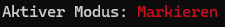

# Dokumentation

# Inhaltsverzeichnis
1. [Einleitung](#introduction)

    1.1 [Vorüberlegung und erste Ideen]()

    1.1 [Vorüberlegung und erste Ideen]()

2. [Programmarchitektur](#2)
3. [Programmablauf](#1)
4. [Testergebnisse und Analyse](#0)


# Einleitung <a name="introduction"></a>

Im Rahmen der Python-Vorlesung an der DHBW im Kurs TIS24 haben die Studenten die Aufgabe bekommen, ein Spiel in Python zu entwickeln. Die folgende Dokumentation dokumentiert meinen Code und meine Ideen, die ich in den letzten Wochen umgesetzt habe.

## Vorüberlegungen und erste Ideeen

Das Ziel des Spiels soll es sein, alle Räume einer Raumstation zu scannen und dabei den Scan eines Raums, der als "gefährlich"  markiert ist, zu vermeiden. Dabei sollen bereits gescannte Räume anzeigen, wie viele der nebenliegenden Räume "gefährlich"  sind.

Die Spielprinzipien sind folgende:

* Es gibt ein Spielfeld mit Bereichen, wobei jeder Bereich _sicher_ oder _gefährlich_ sein kann
* In einem Spielzug kann ein Bereich gescannt werden. Wenn der Bereich _sicher_ ist, erscheint in diesem Bereich eine Zahl die angibt, wie viele umliegende Bereiche _gefährlich_ sind
* Wenn alle _sicheren_ Bereiche gescannt wurden und man keinen _gefährlichen_ Bereiche gescannt hat, hat man das Spiel gewonnen

### Die Raumstation als verbundene Räume

<div style="float: left; margin-right: 15px; max-width: 300px;">
  
</div>


*Abbildung 1: Demonstration von Problemen*

Um die Spielregeln zu erfüllen und den Spielspaß zu garantieren, ist es nötig, sich vorher ein paar Grundideeen zu überlegen. Grundsätzlich wäre es möglich, ein Raster als Spielfeld zu verwenden, allerdings ist eine Raumstation eher eine Ansammlung von Räumen, die miteinander verbunden sind. Somit soll das Programm Räume generieren, welche miteinander verbunden sind. Es gibt aber Probleme, wenn Räume nur über einen Weg verbunden sind. 

Wenn der Spieler in _Abbildung 1_ die Information über Raum 0 hat, dass dieser gefährlich ist aber keine Information über Raum 2 hat, so ist der Scan von Raum 2 rein zufällig und kann, wenn man Pech hat, das Spiel beenden. Solche Situation führen zur Verringerung des Spielspaßes und müssen deshalb vermieden werden, wenn es möglich ist. Trotzdem ist es unvermeidlich, dass Bereiche entstehen könnten, bei welchen ein Raum nur "auf gut Glück" gescannt werden muss. Deshalb hat man im Spielverlauf Joker die dem Spieler verraten, was sich in einem Raum befindet, ohne diesen Scannen zu müssen.


### Räume generieren

Eine der wichtigsten Funktionen ist somit das Generieren von Räumen der Raumstation. Räume werden also in einem Algorithmus generiert, der eine bestimmte Anzahl von Räumen und Verbindungen generiert und dann abbricht. Es müssen zufällig bereits bestehende Räume ausgewählt werden, die nicht bereits an jeder Seite einen Nachbarraum haben. Dann wird dieser zufällig ausgewählte Raum in eine zufällige Richtung erweitert, wenn der neue Raum Nachbar-Räume hat, wird der neue Raum mit diesen Nachbarn verbunden.

### Userinterface
Wohl eines der wichtigsten Dinge für optimale User-Experience ist das Userinterface. Es sollte einfach erkennbar sein, welche Räume man gescannt hat und welche man scannen kann. Ein Userinterface sollte stets einfach zu nutzen sein, aber trotzdem alle wichtigen Informationen auf einen Blick anzeigen. Wichtig für das Spiel ist:
* Eine Karte der Räume
* Gescannte Räume zeigen Anzahl der gefährlichen Nachbarräume an
* Scannen eines neuen Raumes

Eine Karte, die einen Raum darstellt könnte ungefähr so aussehen, wobei jede Raute (#) einen nicht gescannten Raum zeigt und gescannte Räume die Anzahl an nebenliegenden gefährlichen Räumen anzeigen. Die Verbindungen zwischen den Zeichen stellen die Verbindungen der Räume da.

```
  1 - #       # - #
    \ |     / | \
      2 - 1 - # - #
      |       | X |
      #       # - 1
```
*Abbildung 2 Vorüberlegung für die Darstellung von Räumen*

Es muss irgendwie für den User möglich sein, dem Spiel mitzuteilen, welcher Raum als nächstes gescannt werden soll. Es wäre hier nicht praktikabel jedem Raum einfach eine Nummer zu geben den User nach der Nummer des Raumes zu fragen, den er aufdecken möchte, weil es hier Probleme mit einer kompakten Darstellung gäbe. Wie will man denn wie in Abbildung 2 gezeigt, jetzt noch wohlmöhlich 2-stellige Zahlen an die Räume notieren, ohne dass das Userinterface unschön wird?

Eine einfachere Methode für den User, mit unter schwerer im Code, ist die Möglichkeit für den User mithilfe der Pfeiltasten oder den Tasten WASD den Raum der gescannt werden soll auszuwählen. Allerdings entfällt diese Methode, da dies nicht mit den uns zur Verfügung stehenden Modulen umsetzbar ist.

```
    1   2   3   4   5

1   1 - #       # - #
2     \ |     / | \
3       2 - 1 - # - #
4       |       | X |
5       #       # - 1
```
*Abbildung 3 User wählt einen Raum zum Scannen aus*

Um dem User das Scannen eines Raumes zu ermöglichen, muss der User nun durch X- und Y-Koordinate einen Raum auswählen. Dies geschieht am besten durch ein oder zwei Eingaben, wobei der User entweder im Format `x:y` einen Raum bestimmt oder nacheinander X- und Y-Koordinate eingibt. 

Außerdem sollte der User die Möglichkeit haben, Räume nicht nur zu scannen sondern auch zu _markieren_, wodurch ein Raum mit einer bestimmten Farbe **<span style="color:red;">#</span>** markiert wird. Das hilft dem Spieler sich die Räume zu merken, die er als gefährlich identifiziert.

# Das Userinterface: Interaktion mit dem Spiel
Das Userinterface ist das Herz des Spiels. Es macht aus, wie man als Spieler mit dem Spiel umgeht, wie man es empfindet und seine Aktionen kontrolliert.

## Darstellung der Raumstation
Wie oben bereits erwähnt besteht die Raumstation nicht aus einem Raster von Räumen, sondern aus Räumen, die in individuellen Wegen miteinander verbunden sein können.

<div style="float: left; margin-right: 15px; max-width: 300px;">
  
</div>

*Abbildung 4 Finale Raumdarstellung im Userinterface*

Links auf dem Bild sieht man die Darstellung von Räumen, die es in der finalen Spielversion gibt. Das Spielfeld wird als schönes Raster mit Punkten dargestellt, die dem Auge des Nutzers helfen sollen, die Koordinaten eines Raumes schneller zu identifizieren, denn für das Scannen oder Markieren werden diese Koordinaten benötigt.

Nicht gescannte Räume werden als `#` dargestellt. Bereits gescannte Räume geben die Anzahl der Nachbarräume an, die eine Falle enthalten und werden grün markiert, zum Beispiel '**<span style="color:green;">0</span>**' oder '**<span style="color:green;">2</span>**'. Außerdem sind zum Anfang des Spiels bereits einige Räume aufgedeckt, dazu später aber mehr.

Die Gänge zwischen den Räumen, gezeichnet als `|`, `-`, `/`, `\` und `X` symbolisieren hier die Verbindungen zwischen den Räumen. Auch wenn ein Raum neben einem anderen liegt, heißt das nicht zwangsweise, dass diese auch verbunden sind und die Zahl in dem einen Raum angibt, ob der andere Raum _gefährlich_ ist. Es ist dadurch auch die Aufgabe des Spielers, die Raumverbindungen zu beachten und macht das Spiel dadurch viel spannender und auch spaßiger.
<br>
<br>
## Die Legende

<div style="width: 100%;">
  
</div>

*Abbildung 5 Legende unterhalb des Spielfeldes*

In der Legende unterhalb des Spielfeldes werden Spieler Möglichkeiten angezeigt, wie er mit dem Spielfeld interagiert. Der obere Teil dieses Hinweises ist eine Legende mit Statusanzeige. Hier wird dem Spieler angezeigt was eine grüne bzw. rote Farbe auf dem Spielfeld darstellt. In der Statusanzeige wird dem Spieler angezeigt, welcher Modus gerade aktiv ist `scannen` oder `markieren` und dem Spieler wird angezeigt, wie viele Joker er noch zur Verfügung hat. Darunter befinden sich die Hinweise zum Spiel. Mit Druck der Taste `m` kann der Modus gewechselt werden und der neue Modus wird dann in der Statusleiste angezeigt:
<div style="width: 100%;">
  
</div>

Das eigentliche Scannen und markieren wird im nächsten Kapitel erläutert.

## Koordinateneingabe und Joker
Ich habe mich bei der Entwicklung für eine einfache Koordinateneingabe entschieden, bei der die `x` und `y` Koordinate nacheinander eingegeben werden müssen. Mit Druck der Taste `Enter` wird die Koordinateneingabe im aktuellen Modus gestartet. Das heißt, ist der Modus `scannen` ausgewählt, so wird der Raum an den eingegebenen Koordinaten gescannt, ansonsten wird er markiert, weil dann der Modus `markieren` aktiviert ist.

<div style="width: 100%;">
  
</div>

*Abbildung 6 Beispielhafte Koordinateneingabe*

Wie in der Abbildung präsentiert müssen die Koordinaten nacheinander eingegeben werden, während weiterhin die Karte oberhalb sichtbar ist (hier aus Platzgründen weggelassen). Sollte man sich doch anders entscheiden oder merkt man, dass der falsche Modus ausgewählt ist, kann man die Koordinateneingabe durch Eingabe eines `x` bei einer der Koordinaten abbrechen. Nach der Koordinateneingabe bekommt der Spieler noch eine Rückmeldung, die unter anderem so aussehen kann:
* Der Raum wurde aufgedeckt!
* Ein Raum in Zeile 0 an Spalte 0 existiert nicht!
* Der Raum wurde markiert.
* Der Raum ist jetzt nicht mehr markiert.
* Der aufgedeckte Raum enthält eine **<span style="color:red;">Falle!</span>**

Wobei nach letzterer das Spiel endet.

### Joker

Joker sind ein wichtiger Bestandteil des Spiels, weil sie helfen, unangenehmen Spielsituationen die aufgrund der Kartengeneration entstehen, aus dem Weg zu gehen oder zu vermeiden. Durch das Drücken der Taste `j` wird ein Joker ausgewählt. Wenn der Spieler keine Joker mehr hat, bekommt dieser die Rückmeldung "Du hast keine Joker mehr übrig.".

<div style="width: 100%;">
  
</div>

*Abbildung 7 Der Spieler hat einen Joker ausgewählt*

Hier erfolgt die Koordinateneingabe gleich wie beim normalen Scannen oder Markieren. Anschließend wird aber kein Feld aufgedeckt oder markiert, sondern der Spieler bekommt eine Textbenachrichtigung, zb:
* JOKER: Der Raum in Zeile `x` an Spalte `y` ist ein sicherer Raum.
* JOKER: Der Raum in Zeile `x` an Spalte `y` ist eine Falle!

Auch hier gibt es wieder die üblichen Fehlermeldungen wenn ein angeforderter Raum nicht existiert oder bereits aufgedeckt ist (hier würde ja ein Joker keinen Sinn ergeben).

# Wichtige Codebestandteile

## Was ist ein Raum?

Ein Raum ist eine Klasse, die wie folgt definiert ist:

```python
class Room():
    """ Raum-Klasse mit diverser Logik für Räume """
    def __init__(self, x: int, y: int, isDangerous:bool =False) -> None:
        self.isDangerous = isDangerous
        self.isMarked = False
        self.connections = 0b00000000       # Alle Verbindungen auf 0 initialisieren
        self.x = x
        self.y = y
        self.dangerousNearbyRooms = 0
        self.isRevealed = False
        
        # Sowohl x als auch y müssen ganzzahlige Werte sein
        if not (isinstance(x, int) and isinstance(y, int)):
            raise ValueError("X and Y must be integers for map tile position")
```

Wichtige Variablen:
* `isDangerous`: Ist der Raum gefährlich?
* `isMarked`: Ist der Raum markiert?
* `isRevealed`: Ist der Raum aufgedeckt?
* `connections`: Was für Verbindungen hat der Raum zu anderen Räumen?
* `x` und `y`: Die Koordinaten des Raums auf der Karte
* `dangerousNearbyRooms`: Wie viele Räume nebenan sind gefährlich?

Die meisten Variablen sind selbsterklärend, nicht aber die `connections`. Dabei handelt es sich um eine kluge Methode, die Verbindungen zu anderen Räumen effizient in kleinem Speicherplatz zu speichern.

### Wie funktionieren Raumverbindungen?

Man hätte gut und leicht daran getan, jedem Raum einfach ein `Room[]` zuzuweisen, das alle Räume enthält die mit dem Raum verbunden sind. Das wäre aber zu einfach - und zu ineffizient. Mit dem finalen Ansatz gibt es für jeden Raum nur ein Byte der angibt, welche Verbindungen es gibt. Da das Spielfeld ein Raster ist, gibt es nur acht verschiedene Richtungen in die ein Raum verbunden sein kann:
```python
#       Verbindungen
#
#         7   0   1
#          \  |  /
#           #####
#      6 -  #   # - 2
#           #####
#          /  |  \
#         5   4   3
#
```
Ein Byte besteht aus acht Bit, jedes Bit kann 0 oder 1 sein. Dementsprechend eignet sich ein Byte perfekt, um diese Konstellationen darzustellen. Man nummeriert im Byte von 0 bis 7 alle Stellen und jede Stelle repräsentiert dann dann für einen Raum, ob der Raum in diese Richtung eine Verbindung hat oder nicht.

### Helfer-Funktionen
Dafür werden bestimmte Helferfunktionen benötigt, die relative Koordinaten (zum Beipiel `x=1`, `y=0` - was _"nach rechts"_ bedeutet würde) umwandelt in das Bit, das gesetzt sein muss damit diese Verbindung tatsächlich existiert (bei diesem Beispiel wäre das Bit `2` [siehe oben]).

Die Datei `mapHelper.py` im Ordner `source/map` enthält diese Funktionen. Eine dieser Funktionen ist hier beispielhaft: 

```python
def getDirectionByPositionOffset(position: tuple[int, int]) -> int:
    match(position):
        case (0, -1):
            return 0
        case (1, -1):
            return 1
        case (1, 0):
            return 2
        case (1, 1):
            return 3
        case (0, 1):
            return 4
        case (-1, 1):
            return 5
        case (-1, 0):
            return 6
        case (-1, -1):
            return 7
    raise ValueError("Offset coordinates could not be converted into direction index")
```
Diese Funktion konvertiert ein Positionsoffset zwischen zwei Räumen in das benötigte Bit das gesetzt sein muss. Hierbei ist aber zu beachten, dass die Funktion die das Positionsoffset zwischen bei Räumen berechnet nicht kommutativ ist und hier also vorsichtig mit den Koordinaten und Bits umgegangen werden muss, denn eine falsche Reihenfolge kann schnell alles kaputt machen.

## Was ist eine Karte?

Auch hier hätte man es anders machen können und einfach ein Array oder ebenfalls eine Bitmaske haben können, das angibt, wo sich ein Raum befindet und in weiteren Arrays dann Informationen zu der Kartenbegebenheit gespeichert. Räume haben sehr viele individuelle Variablen, deshalb wäre dieser Ansatz sehr unübersichtlich geworden. Im Endeffekt ist ein Raum nur eines: Eine Sammlung (Array) von Räumen.

## Spielstart - Räume generieren
Zum Spielstart ist das Spielfeld leer. Das Spielfeld wird in jedem Spiel neu generiert, sodass Abwechslung beim Spielen garantiert ist. Die Generierung eines Spielfeldes ist eine große Herausforderung, da es viele verschiedene Konstellationen zwischen Räumen gibt. Es muss ein grundlegendes Schema festgelegt werden, nachdem die Generierung passiert:
```
  1. einen Raum in der Mitte der Karte erzeugen
  2. eine zufällige Richtung aussuchen
  3. in diese Richtung einen Raum erzeugen und beide Räume verbinden

  4. einen zufälligen Raum auf der Karte auswählen
  5. eine zufällige Richtung aussuchen
    6a: wenn ein Raum in diese Richtung exisitert, beide Räume verbinden
    6b: ansonsten einen Raum in diese Richtung erzeugen und Verbindung herstellen
  7: gehe so lange zu 4 bis genügend Räume existieren

  8: Solange alle Räume die nur eine Verbindung haben entfernen, bis nur noch Räume mit mehr als einer Verbindungen übrig bleiben
```

Anschließend müssen Räume als _sicher_ oder _gefährlich_ klassifiziert werden:
```
  1. gehe alle Räume durch
    2. setze Räume zufällig auf "gefährlich" mit einer bestimmten Wahrscheinlichkeit
  3. gehe nochmal alle Räume durch
    4. setze für jeden Raum die Anzahl an gefährlichen Nachbarräumen, sodass diese später nicht berechnet werden muss
```
Im Code sieht das in etwa wie folgt aus (unwichtige Teile zum Platzsparen weggelassen):


# Programmarchitektur

## Projektaufbau

```
.
├── mypy.ini
├── README.md
├── requirements.txt
├── documentation
│   └── documentation.pdf
├── source
│   ├── main.py
│   └── example.py
└── tests
    ├── test_main.py
    └── test_example.py
```

Der Projektaufbau folgt den Bestimmungen in den Anforderungen an das Projekt.

# Programmablauf
# Testergebnisse und Analyse